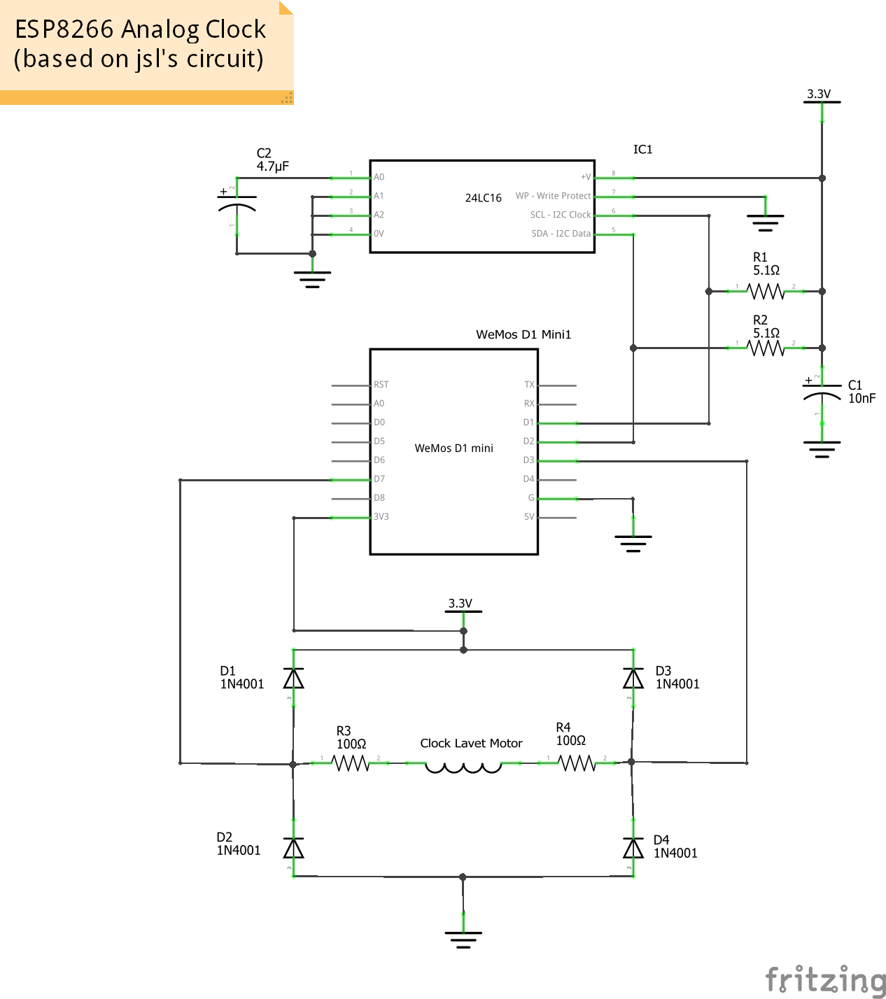
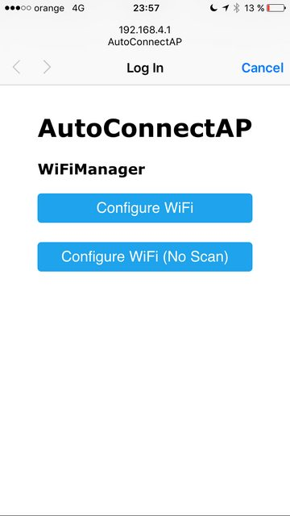
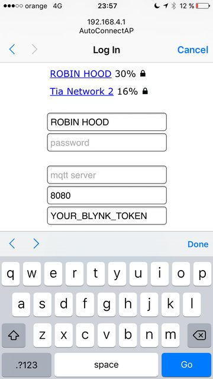
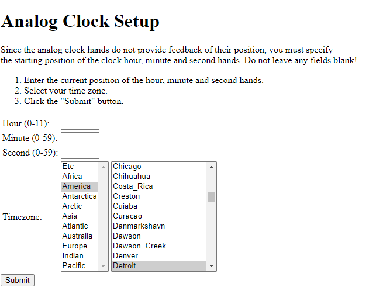
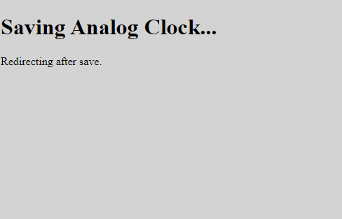
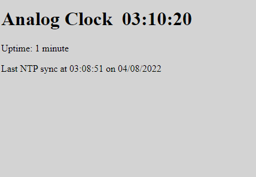

# ESP8266 WiFi Analog Clock V2

## Introduction

The ESP8266 Analog clock uses an WEMOS D1 Mini ESP8266 module to connect to a NTP (Network Time Protocol) server to automatically retrieve and display the local time on a hacked analog quartz clock. The ESP8266 reconnects to the NTP server to keep the clock accurate. The clock also automatically adjusts for daylight savings time.

From the original project, the biggest problem with using these cheap analog clocks for a project like this is that the clocks don't provide any type of feedback to indicate the position of the clock's hands.  To get around this problem, the positions of the hour, minute, and second hands are stored in a EEPROM backup and updated each second as the clock's hands positions change. The first time that the sketch is run, the user will be directed to a simple web page served by the ESP8266 which is used to tell it where the analog clock's hands are initially positioned. From that point on, the ESP8266 will use the data stored in the EERAM to "remember" the positions of the clock's hands.

This project is a migration of the ESP8266-WiFi-Analog-Clock (https://github.com/jim11662418/ESP8266-WiFi-Analog-Clock) to use Platform IO with various library changes. With the significant changes it was easier to create a new project rather than fork the existing repo.  Changes from the original project to this one are:
* Migrated to use Platform IO as IDE
* Migrated NTP library to the new library created by the NTP library developer (gmag11/ESPNtpClient)
* Moved to using i2c_eerom library
* Now using WiFiManager to connect to Wifi network (avoids need to hardcode wifi passwords)
* Expanded Timezone to be worldwide rather than the United States.
* Simplified circuit by removing push button and multi-color LED.

## Hardware

### Shopping List

- 1 Cheap analog clock
- 1	Electrolytic Capacitor	capacitance 10nF; 
- 1	Electrolytic Capacitor	capacitance 4.7µF; 
- 4	Rectifier Diode	type Rectifier;
- 1	24LC16	 (see note)
- 2	5.1Ω Resistor	
- 2	100Ω Resistor	
- 1	WeMos D1 Mini	
- 1   Hook-up wire

*Optional*
- 1 ESP8266 female mounting sockets 
- 1 IC socket for 24LC16
- 1 two wire socket 
- 1 two wire plug 

*Note*
The 24LC16 can be substituted for a larger EEROM if required.   Update the following line in src/AnalogClock.cpp with the device size:

    I2C_eeprom ee(0x50, I2C_DEVICESIZE_24LC16);

### Circuit

#### Key
- C1	Electrolytic Capacitor	10nF; 
- C2	Electrolytic Capacitor	4.7µF;
- Clock Lavet Motor		
- D1	Rectifier Diode 1N4001
- D2	Rectifier Diode 1N4001
- D3	Rectifier Diode 1N4001
- D4	Rectifier Diode 1N4001
- IC1	24LC16	
- R1	5.1Ω Resistor
- R2	5.1Ω Resistor
- R3	100Ω Resistor
- R4	100Ω Resistor
- WeMos D1 Mini

*Note: this circuit swaps the circuit's original routing of the I2C wires so that that the I2C clock and data pins to use the ESP8266 defaults.*

Modify the analog clock to be controlled by the ESP8266 module by connecting wires to the Lavet stepping motor's coil and disconnect the coil from the quartz oscillator. Search the web for details on how to do this.

Once the above circuit is built and mount it on the back of the clock as indicated below.  (Note the image below includes a number of additional items from V1 of the ESP8266 Analog Clock such as a push button and led.)

## Software

1. Clone this repo and run up PlatformIO.
2. Connect ESP8266 circuit and do a build; libraries will automatically download.
3. Run upload and monitor

### Trouble Shooting

* Update the IC parameter (see above) if using a larger/smaller EEROM.
* Increase or decrease the "PULSETIME" constant by few milliseconds to make your mechanism step reliably.
* Change the NTPSERVERNAME constant to the name of a local NTP server.

## Setup

These are the steps to configure the clock.  

### Wifi 

On first boot, or unable to connect to the configured Wifi network, the Wifi manager switches over being a wifi access point named 'ClockSetupAP'.  Connect to this access point and your computer will redirect to the following pages.   Connect to your local Wifi point and save.    

(Images taken from the WifiManager library repo: https://github.com/tzapu/WiFiManager)

### Clock Setup

Once connected to a Wifi point, the code will enter a boot process connectiing to the wifi and NTP server.   Take note of the ip address for the webserver. 

Once the boots are complete, a 10 second countdown will be shown on the console for enter configuration mode.  Now press any key to enter configuration then browse to the ip address noted above during the boot process.   The webpage will now look like the following, enter the positions of the:
* Hour hand
* Minute hand 
* Second hand

And select the timezone you are in by first selecting the area then the nearest city to your location then hitting Submit.

Once you click 'Submit', you will see the following page to indicate it is saving the setup.   

Once save is complete, it'll redirect to the following clock page.  

### Troubleshooting

As each analog clock is different, I've found that some tuning is required to get a consistent working clock.   

#### ESP8266 light flashes but nothing after a minute

* Change power supply
    * I've had a problem where one power supply would work but another (same Voltage and Amps) would not.
    * I suspect that some phone 5V USB chargers don't work well with draw in amps for moving the Lavet motor.
* Check for loose connections
    * Connect to PC and monitor output to confirm all is running
    * If NTP and web configuration countdown ok, turn off power and check connections.

#### NTP sync timesout

* Look in AnalogClock.cpp and search for const char* NTPSERVERNAME
* Comment out the current NTPSERVER then
    * Uncomment an existing server that is closer to your location
    * or add the hostname of a local NTP server
* Rebuild and upload firmware

#### Seconds hand ticks but does not tock
This is the case where every other tick the seconds hand doesn't move.

* Open up AnalogClock.cpp
    * Find #define PULSETIME
    * Increase the value by 5 (See note on PULSETIME value below)
* Rebuild and upload firmware

#### After running for a while, the second hand stops
Check the web page to see if it is running, the likely issue is the magnetic gear that the lavet motor turns has turned too far around as the pulse is too long.

* Open up AnalogClock.cpp
    * Find #define PULSETIME
    * Decrease the value by 5 (See note on PULSETIME value below)
* Rebuild and upload firmware

#### Note on PULSETIME value
The pulse time is the length of time, in milliseconds, that the lavet motor is activated to turn the magentic gear.

* A Pulsetime of 25 seems to be a good starting point.
* Increasing and decreasing by 5 seems to be the fastest way  to find the value that works with your clock.

In the event that no one value seems to work when increasing/decreasing by 5:
* Start the Pulse time in a very low value
* Increase pulse time by five until second hand consistency ticks for each second
* Leave running, if it doesn't stop after running for 24 hours, stop and use this value.
* Take the current pulse value and decrease by five.
* Now increase pulse time by 1 until a consistent ticking of the second hand occurs.
* Use this value as the pulse time.

## Future improvements

* Bug: Handle case that NTP is 24hr format but the clock hands are 12 hours.
    * Behaviour that occurs is that the clock advances 12 hours until it is internally consistent.
* Implement a slow tick to indicate when clock is waiting for time to catch-up  
    * e.g. 2 ticks within a second, then wait 9 seconds
* Suggest timezone
    * Use this which appears to work in browsers: Intl.DateTimeFormat().resolvedOptions().timeZone
* Publish the ip address under dns (e.g. clock.local)
* Configure via the webpage:
    * NTP server hostname
    * Pulse time
* Real-time clock adjustment
    * Allow user to let the clock know the actual position of the hands while running
    * Need to figure out security approach to prevent unauthorised modification
* Reduce NTP sync accurate for a faster sync response
    * Only need to be within 1-5 seconds?
